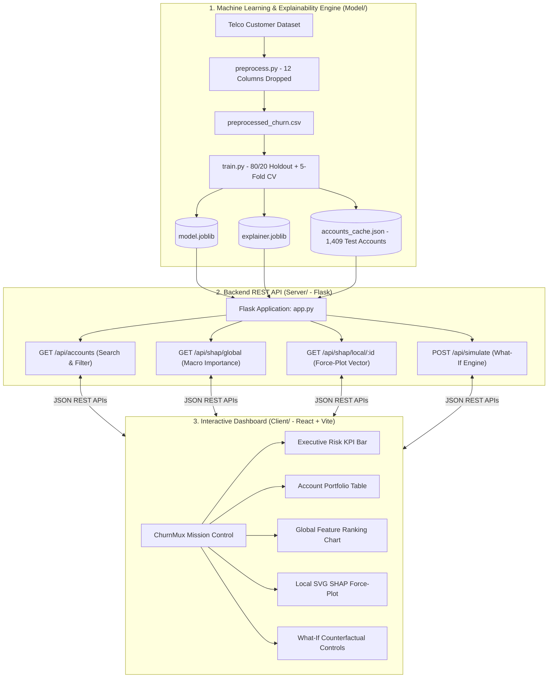

# ChurnMux ⚡
### Explainable Customer Churn Prediction Engine with SHAP Force-Plot Dashboard

[](https://python.org)
[](https://lightgbm.readthedocs.io/)
[](https://shap.readthedocs.io/)
[](https://flask.palletsprojects.com/)
[](https://react.dev/)
[](LICENSE)

---

## 📌 Executive Summary

**ChurnMux** is an enterprise-grade, end-to-end churn intelligence platform built for **Problem Statement 16**. Traditional machine learning models act as "black boxes" — they flag customers as high-risk but fail to provide actionable reasoning for *why* the customer is leaving.

ChurnMux bridges this gap by coupling a high-performance **LightGBM binary classifier** with **SHAP (SHapley Additive exPlanations)** and an interactive **What-If Counterfactual Lab**. Revenue and Customer Success teams can drill down into individual account attributions, understand exact pushing/pulling forces, and simulate retention strategies in real time with sub-50ms latency.

---

## 🚀 Key Features

- **🔍 Interactive SHAP Force-Plot Visualizer (Local Explainability)**: Custom dynamic SVG force-plot decomposing an individual account's prediction into positive red forces (pushing towards churn) and negative blue forces (anchoring retention) from the portfolio baseline.
- **📊 Global Feature Impact Ranking (Macro Explainability)**: Mean absolute SHAP ($mean(|\phi|)$) analysis identifying the highest-leverage churn drivers across the entire account portfolio.
- **🧪 What-If Counterfactual Simulation Lab**: Live sandbox allowing managers to adjust contract terms, service subscriptions, and pricing sliders to observe instant churn probability reduction and live force-plot rebalancing.
- **🛡️ Rigorous Out-of-Sample Methodology**: Zero in-sample leakage. Model training is isolated to an 80% train split, while all dashboard accounts, evaluation metrics, and SHAP explanations are derived strictly from the **held-out 20% test cohort (1,409 unseen accounts)**.
- **⚡ High-Performance Architecture**: Single-command runner (`npm start`) concurrently orchestrating the Flask API and React + Vite dev server with sub-100ms API response times.

---

## 🏗️ System Architecture



---

## 🔬 Machine Learning Pipeline & Metrics

### 1. Data Cleaning & Sanitization ([Model/preprocess.py](Model/preprocess.py))
- **Leakage Dropped**: `Churn Reason` (100% missing on non-churners), `Churn Score`, `Churn Label`.
- **Zero-Variance Dropped**: `Count` (all 1), `Country` (all US), `State` (all CA).
- **Redundant Geographic & ID Dropped**: `CustomerID`, `Lat Long`, `City`, `Zip Code`, `Latitude`, `Longitude`.
- **Anomalies Resolved**: Fixed 11 whitespace-only cells in `Total Charges` (tenure = 0 subscribers) and cast to `float64`.
- **Sub-Category Normalization**: Standardized `'No internet service'` and `'No phone service'` $\rightarrow$ `'No'` across all 7 dependent services.

### 2. Out-of-Sample Performance (20% Held-Out Test Set: 1,409 Accounts)

| Metric | Score | Note |
|---|---|---|
| **Test ROC-AUC** | **0.850** | Strong discrimination between churned and retained accounts |
| **Test PR-AUC** | **0.666** | Robust precision-recall area on imbalanced target (26.5% base rate) |
| **Test Recall (Catch Rate)** | **74.4%** | Captures ~3 out of every 4 churning accounts |
| **5-Fold CV Mean ROC-AUC** | **0.859 $\pm$ 0.012** | Validates generalization stability across folds |

### 3. Top Global Churn Drivers

1. **Contract Term** ($mean(|\phi|) = 1.008$): Month-to-month contracts are the #1 driver of account departure.
2. **Dependents** ($mean(|\phi|) = 0.771$): Single/independent accounts churn at significantly higher rates.
3. **Tenure Months** ($mean(|\phi|) = 0.460$): Account maturity serves as the primary retention anchor.
4. **Internet Service** ($mean(|\phi|) = 0.301$): High-tier fiber plans exhibit elevated price-sensitivity churn.

---

## 📁 Repository Structure

```
MeetMux/
├── pyproject.toml                      # Python dependency specification (uv)
├── uv.lock                             # Pinned multi-platform lockfile
├── package.json                        # Root npm script runner
├── run_all.js                          # Concurrent orchestrator (Backend + Frontend)
├── .gitignore
│
├── Model/                              # ML & Explainability Pipeline
│   ├── Dataset/
│   │   ├── Telco_customer_churn.xlsx   # Source dataset
│   │   └── preprocessed_churn.csv      # Cleaned 21-feature dataset (0 nulls)
│   ├── preprocess.py                   # Data sanitization pipeline
│   ├── audit_dataset.py                # Exploratory audit script
│   ├── train.py                        # LightGBM training + SHAP generation
│   └── artifacts/                      # Exported artifacts
│       ├── model.joblib                # Trained LightGBM booster
│       ├── explainer.joblib            # SHAP TreeExplainer
│       ├── global_shap.json            # Precomputed global ranking
│       ├── feature_metadata.json       # Feature mappings & model metrics
│       └── accounts_cache.json         # 1,409 unseen test accounts
│
├── Server/                             # Flask REST API
│   ├── app.py                          # Application factory & CORS
│   ├── config.py                       # Configuration & paths
│   ├── services/
│   │   ├── model_service.py            # Real-time inference
│   │   ├── shap_service.py             # Force decomposition logic
│   │   └── account_service.py          # Account search & filtering
│   ├── routes/
│   │   ├── account_routes.py           # /api/accounts & /api/accounts/stats
│   │   ├── shap_routes.py              # /api/shap/global & /api/shap/local/:id
│   │   └── predict_routes.py           # /api/simulate & /api/predict
│   └── schemas/
│       └── request_schemas.py          # Payload validation
│
└── Client/                             # React 18 + Vite Dashboard
    ├── package.json
    ├── vite.config.js
    ├── index.html
    └── src/
        ├── App.jsx                     # Dashboard container
        ├── index.css                   # Mission Control dark design system
        ├── services/api.js             # API client wrapper
        ├── components/
        │   ├── Header.jsx              # System status & model AUC badges
        │   ├── KPICards.jsx            # Portfolio metrics (ARR at risk, Churn rate)
        │   ├── AccountTable.jsx        # Sortable, filterable risk table
        │   ├── GlobalSHAPChart.jsx     # Macro feature importance bar chart
        │   ├── LocalForcePlot.jsx      # Custom SVG SHAP Force-Plot renderer
        │   └── WhatIfSimulator.jsx     # Interactive counterfactual controls
        └── hooks/
            └── useDashboardData.js     # State management & reactive data wiring
```

---

## 🛠️ Quickstart Guide

### Prerequisites
- **Python 3.11+** with [`uv`](https://docs.astral.sh/uv/) installed:
  ```powershell
  pip install uv
  ```
- **Node.js 18+** & `npm`

---

### Single-Command Launch (Backend + Frontend)

From the project root directory:

```powershell
# 1. Install Python dependencies
uv sync

# 2. Install Frontend dependencies
cd Client && npm install && cd ..

# 3. Launch Full-Stack Application
npm start
```

Open your browser and navigate to:
👉 **`http://localhost:5173`**

---

### Manual Launch (Separate Terminals)

#### Terminal 1: Backend API
```powershell
uv run python Server/app.py
# Runs on http://127.0.0.1:5000
```

#### Terminal 2: Frontend Dashboard
```powershell
cd Client
npm run dev
# Runs on http://localhost:5173
```

---

## 🔌 REST API Reference

| Method | Endpoint | Description | Sample Query / Payload |
|---|---|---|---|
| `GET` | `/api/health` | Service health, model status & metrics | None |
| `GET` | `/api/accounts/stats` | Macro portfolio totals (ARR at risk, % critical) | None |
| `GET` | `/api/accounts` | Paginated account list with risk filtering | `?risk_level=CRITICAL&page=1&limit=10` |
| `GET` | `/api/accounts/:id` | Full raw feature telemetry for single account | `ACC-2222` |
| `GET` | `/api/shap/global` | Mean absolute SHAP feature ranking | None |
| `GET` | `/api/shap/local/:id` | Positive/negative SHAP force vectors for account | `ACC-2222` |
| `POST` | `/api/simulate` | Counterfactual What-If simulation engine | `{"base_account_id": "ACC-2222", "overrides": {"contract": "Two year", "tech_support": "Yes"}}` |

---

## 🚢 Deployment Guide

### Deploying to Render (Backend) + Vercel (Frontend)

#### 1. Backend on Render
- Create a new **Web Service** pointing to your repository.
- **Build Command**: `pip install uv && uv sync --frozen`
- **Start Command**: `uv run python Server/app.py`
- Copy your Render URL (e.g. `https://churnmux-api.onrender.com`).

#### 2. Frontend on Vercel
- Import repository on Vercel with **Root Directory** set to `Client`.
- Add Environment Variable:
  - `VITE_API_URL` = `https://churnmux-api.onrender.com`
- Deploy!

---

## 📄 License

This project is licensed under the MIT License — see the [LICENSE](LICENSE) file for details.